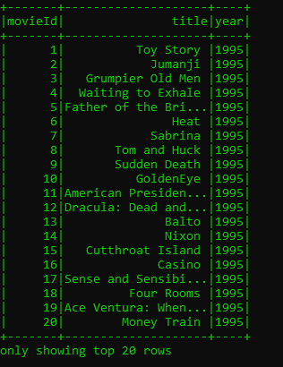
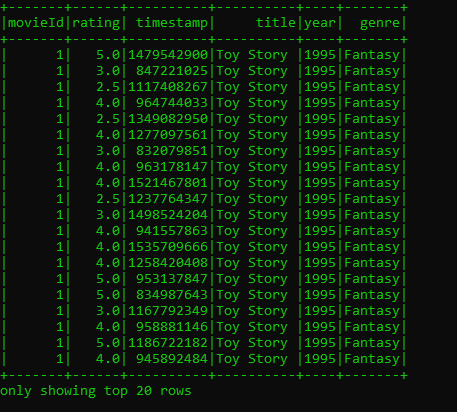
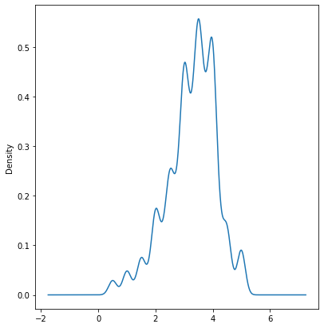
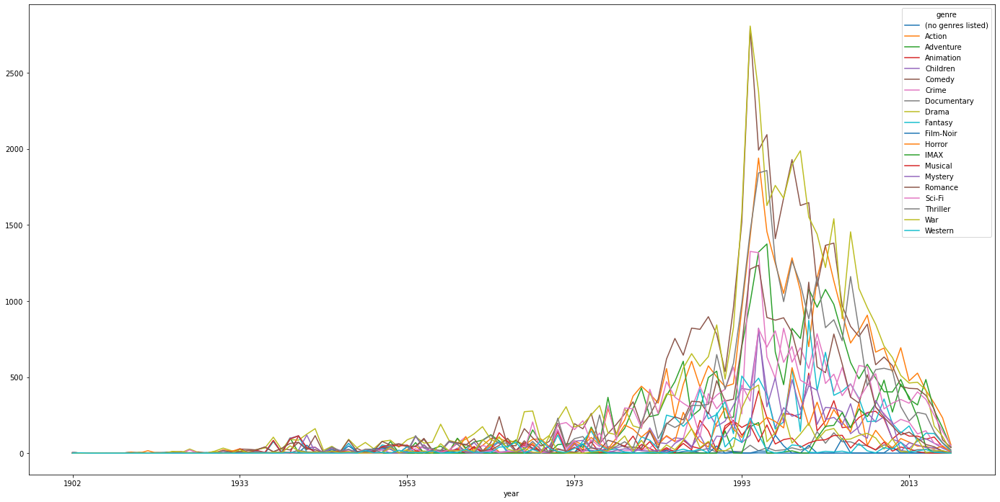

## TP3 Spark - base de données de films - Ajarra Ayoub
----------------------
# Description de la base de donnée : 


Pour une première investigation sur la base de données, on commence par voir la forme des lignes de la dataframe en en utilisant directement le code suivant sur `Jupyter Notebook` (On peut directement lire les données sur pyspark en transormant le fichier csv en une dataframe pyspark) :
```
import pandas as pd
df = pd.read_csv("TP3_Spark_Submit/data/movies.csv")
```

La base de données a la forme suivante: 


> **Remarque:** 
Parmi les colonnes de la base de donénes `movies.csv`, la colonne 'title' contient plus qu'une variable (title et date), on va donc les séparer dans une première partie en utilisant PySpark. Et vu que la variable MovieId est en str, on doit donc la transformer en un type entier.

## Première partie: Traitement de la base de données: 

> **Movies Database:** 

Le projet qui traite le nettoyage de la base de données est structuré suivant le shéma suivant :

```

----> TP3_spark_Ayoub_Ajarra     

      -----> Data      
             ----> Output 
             ----> movies.csv
             ----> movie_genre.csv
             ----> ratings.csv
     -----> Jobs
           ------> movies.py
           ------> movies_genre.py
           ------> rating.py
     ------> jobs.zip
     ------> main.py     
      
```


> Remarque: 

Pour avoir un fichier à la sortie contenant les bases de données traitées, on doit créer un fichier `jobs.zip` à partir du `dossier jobs`.

Le script qui s'occupe du nettoyage de la base de données `movies.csv` est `movies.py`on va lancer la commande `spark-submit  --py-files jobs.zip --files config.json  main.py --job movies` dans la même directory du projet, on obtiendra un fichier de données nettoyées dans le dossier output sous forme parquet.

La Dataframe devient :



Le même raisonnement sera fait sur la base de données  `movie_genres.csv` pour séparer les genres de films et pour transformer le type de la variable `moviedId` d'un str en un entier int, pour celà on éxécute la commande suivante sur le terminal : `spark-submit  --py-files jobs.zip --files config.json  main.py --job movies_genre`

Pour le nettoyage de la base de données `movie_genres.csv`, on ne fait que supprimer la colonne du `UserId` qui ne sera pas utile pour notre étude. On éxécute ensuite la commande : `spark-submit  --py-files jobs.zip --files config.json  main.py --job ratings`


Tous ces fichiers sont transmis au le dossier output. Le fichier output contient donc les bases de données nettoyés et qui sont stoquées sous l'extension `parquet`.


## Analyse de la culture humaine en se basant sur les préférences des genres de films depuis 1902:

Jusqu'ici on a trois bases de données traitées, qu'ont doit les rassembler en utilisant leurs colonne commune : `MovieId`.

On crée un dossier qu'on appelera `Old_good_movies` et notre projet sera organisé de la façon suivante:

```

----> TP3_spark_Ayoub_Ajarra     

      -----> Data      
            ----> Output 
                   ----> movies.parquet
                   ----> movie_genre.parquet
                   ----> ratings.parquet
     -----> Jobs
           ------> Dataframes_merging.py
     -----> Jobs.zip
     ------> main.py     
      
```

On utilisera à la fin un code en `Jupyter Notebook` pour visualiser les données.

Dans le terminal, on lance la commande suivante `spark-submit --py-files jobs.zip --files config.json main.py --job Dataframes_merging`, qui genère en output un fichier parquet contenant une Dataframe nettoyée, prête pour l'utilisation qui est sous la forme suivante :



> Le but de cette partie est d'étudier le développement de la culture chez l'Homme en analysant ses préférences des films.

Tout d'abord, on peut faire la remarque que la variable `rating` est très proche d'une gaussienne, cette hypothèse peut être généralisé à tous les phénomènes naturels ou humains. On retrouve la loi gaussienne partout dans la nature, on peut se poser la question si la loi qui décrit un comportement humain ou naturel peut être une approximation d'une loi gaussienne non centrée.



Le graphe suivant permet de faire une analyse sur les genres de films qui ont apparu au cours de ces 100 dernières années, on pourra faire une analyse de séries temporelles, et ajouter des données historiques pour faire un lien de causalité ou autre avec l'histoire de l'homme au cours du dernier siècle.


