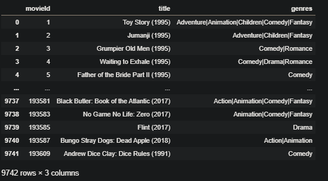
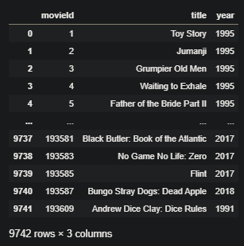

## TP3 Spark - base de données de films - Ajarra Ayoub
----------------------
# Description de la base de donnée : 


Pour une première investigation sur la base de données, on commence par voir la forme des lignes de la dataframe en en utilisant directement le code suivant sur `Jupyter Notebook`:
```
import pandas as pd
df = pd.read_csv("TP3_Spark_Submit/data/movies.csv")
```

La base de données a la forme suivante: 


> **Remarque:** 
Les colonnes de la base de donénes `movies.csv`, contiennent plus qu'une variable, on va donc les séparer dans une première partie en utilisant Spark.

## Première partie: Traitement de la base de données: 

On commencera par nettoyer la base de données, en séparant les variables dans les base de données:

> **Structure du projet pour le nettoyage de la base de donnée:** 
Les colonnes de la base de donénes `movies.csv`, contiennent plus qu'une variable, on va donc les séparer dans une première partie en utilisant Spark.

Le projet qui traite le nettoyage de la base de données est structuré comme suit :

```

----> TP3_spark_Ayoub_Ajarra     

      -----> Data      
             ----> Output  
      -----> Data Preprocessing
             -----> Jobs
                    ------> make_change_movies.py
                    ------> make_change_movies_genre.py
     ------> main.py     
      
```

Pour séparer les variables  `Date` et  `Titre` des films on va lancer la commande `spark-submit  --py-files jobs.zip --files config.json  main.py --job make_change_movies`
Pour séparer les genres dans la variable `genre`,  on va lancer la commande `spark-submit  --py-files jobs.zip --files config.json  main.py --job make_change_movies_genre`

Après que le code finit de tourner, le dossier output contiens les bases de données nettoyés et qui sont stoquées sous l'extension `parquet`, en ouvrant ce fichier sous forme de dataframe :


